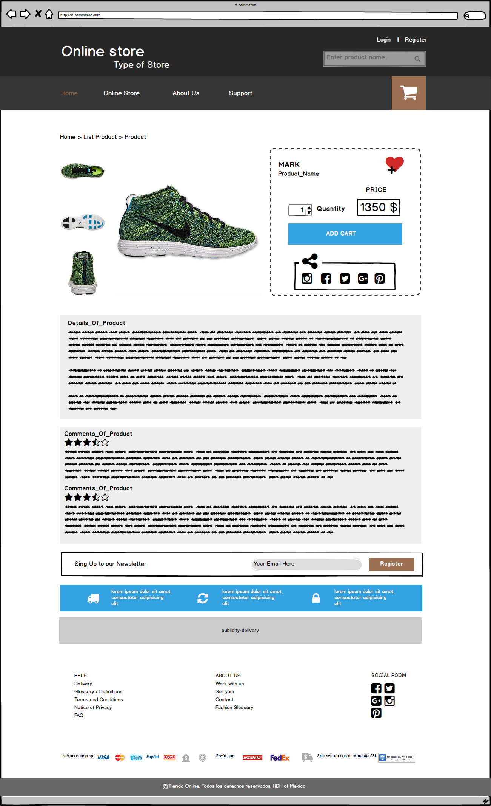
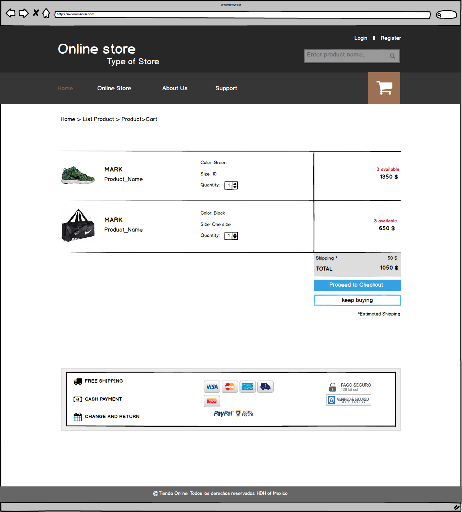
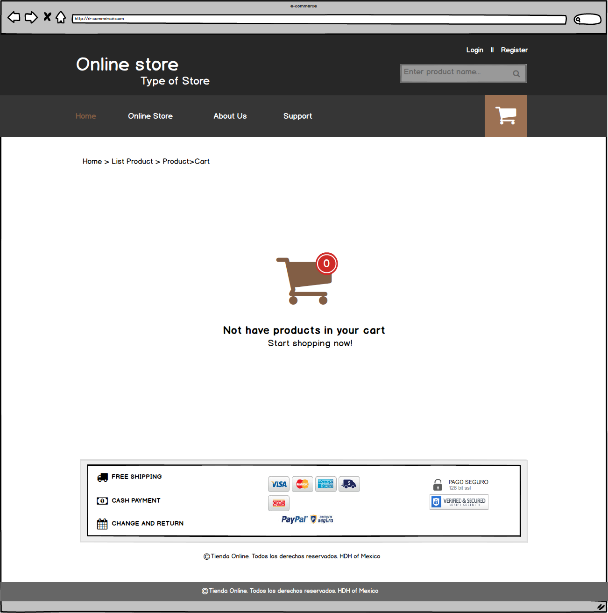
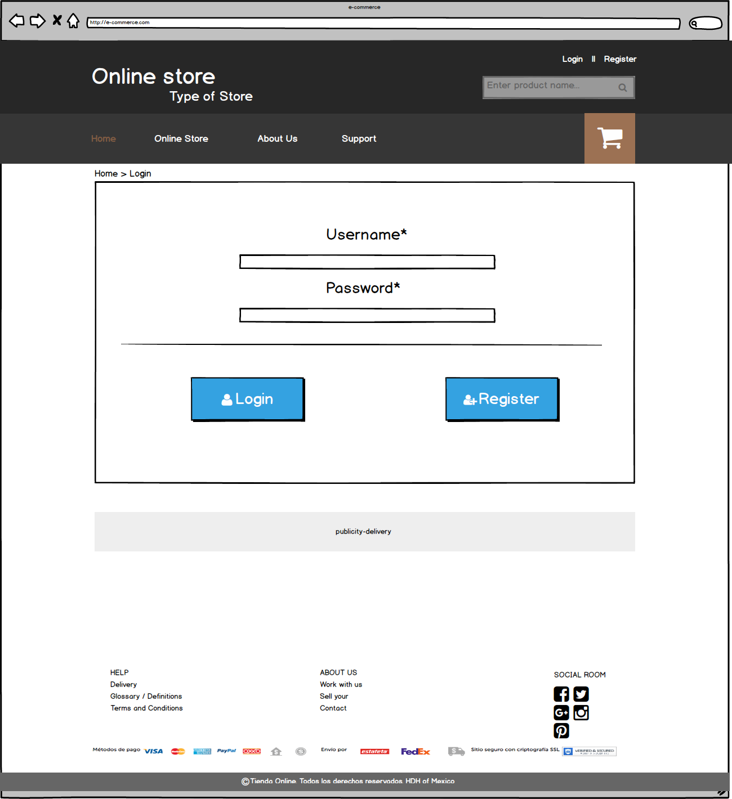
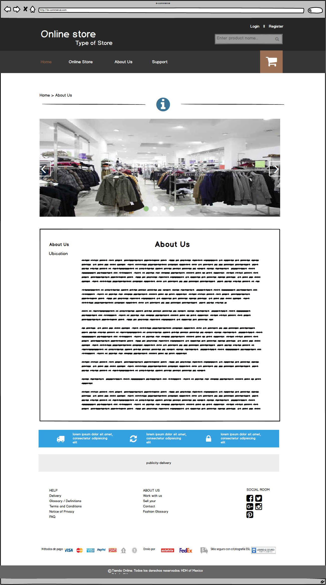
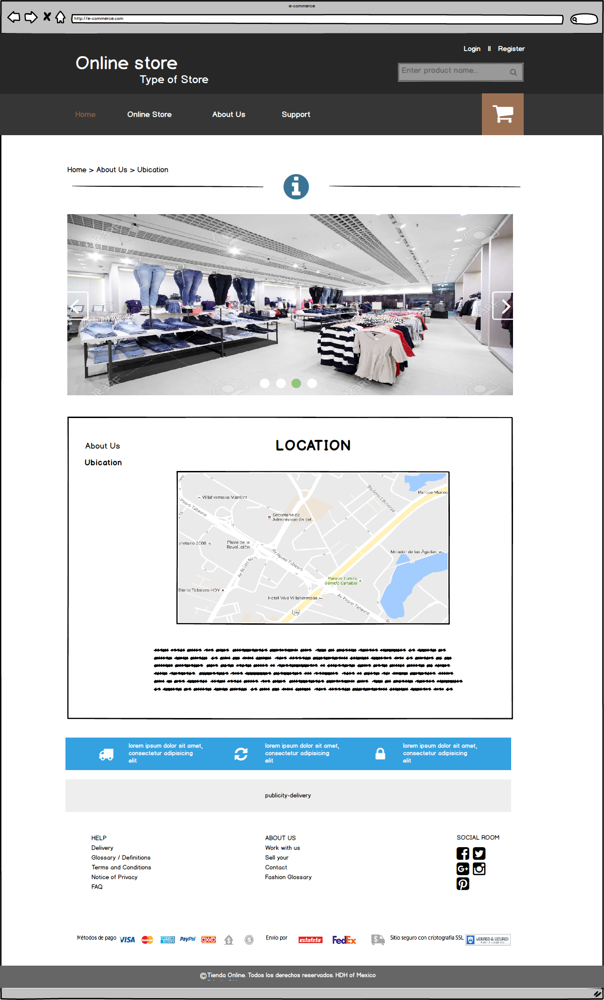
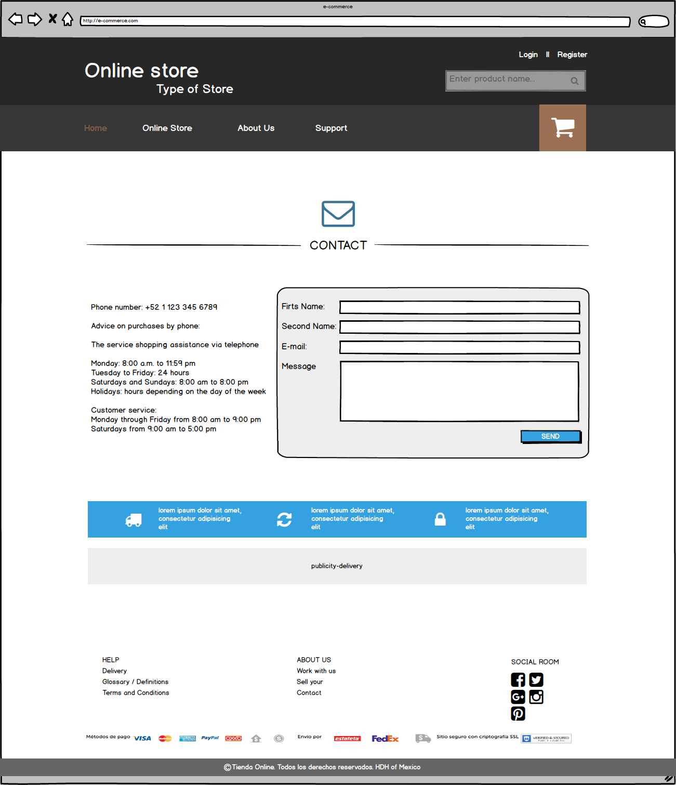
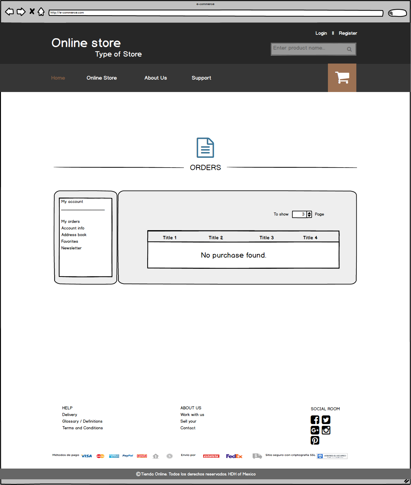
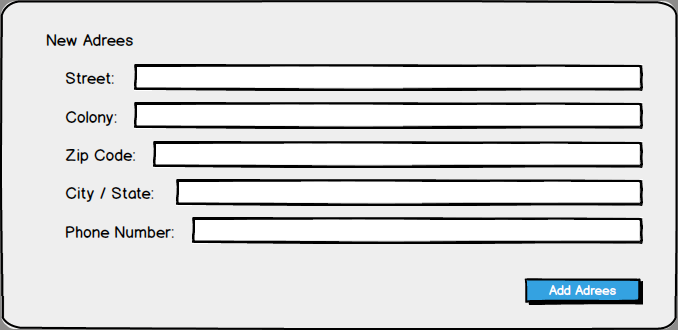
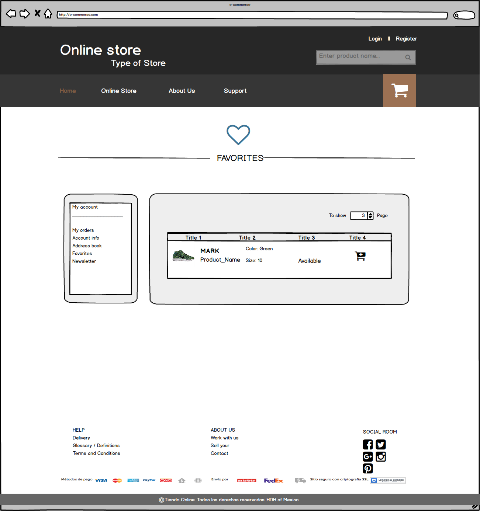

# E-commerce platform

## First Iteration

- [ ]  As a anonymous user I want see main page and the main products.  
- [ ]  As a anonymous user I want see the offers in to main page.   
- [ ]  As a anonymous user I want to go into products details.   
- [ ]  As a anonymous user I want add to cart a product.  
- [ ]  As a anonymous user I want to contact with customer care store.  
- [ ]  As a anonymous user I want register me for login.  
- [ ]  As a anonymous user I want login.  
- [ ]  As a anonymous user I want to register me at newsletter.  
- [ ]  As a registered user I want make all the functions of the anonymous users  
- [ ]  As a registered user I can add to favorites various product.  
- [ ]  As a registered user I want buy the products of my cart.  
- [ ]  As a registered user I want modify the data of my account.  
- [ ]  As a registered user I want add various credit card.  
- [ ]  As a registered user I want add various address to my account.  
- [ ]  As a registered user I want to see my historical of the sales and follow shipping.

Map site

Index

Home showing products by category in the main section, deals of the day, as well as products of interest to the user.

List products

Pagina con lista de productos por categoria y filtros, asi como tambien puede mostrar los productos resultado de la busqueda del usuario

Product details

Web page with details of the product selected by the user, this page shows images of the product; Section with details of purchase, with the name and price of the product, quantity, buy button, button add to favorites and buttons to share product on social networks; Section with product description and comments of the current buyers about the product; Section to register for our newsletter.

Shopping cart

Web page of shopping cart to check the list of added products as well as unit price and total price of the aggregate, with buttons to proceed to the final purchase or continue shopping in the store.

Empty cart

Web page cart empty displays a message when entering this section and have nothing added.

Login

Web page to login if already registered or otherwise has a button to register

Register

Web page for registration of new users.

About Us

Web page with information about the store.

Location

Web page with information about the location of the store.

Support

Web page to contact customer care Store.

Profile

User section showing profile information.

My Orders

User section showing information about ongoing and completed purchases

Address Book

User section showing information about the address where you receive shipments, you can add multiple addresses

Add Address Modal

User section to add address for shipping the product.

Favorites

User section showing a list of products added as favorites, has a button to add the product to the cart so easy

